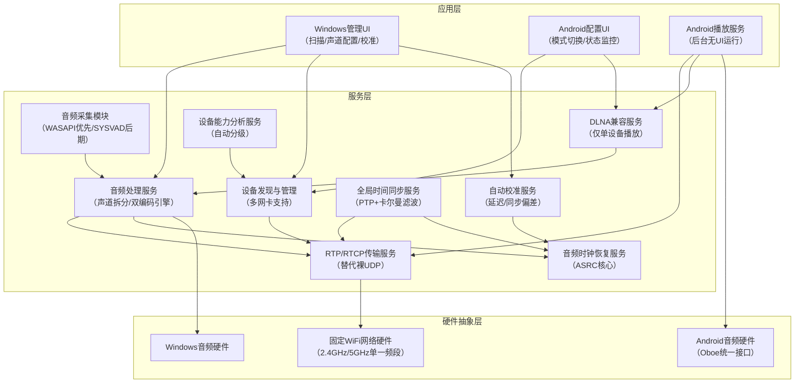
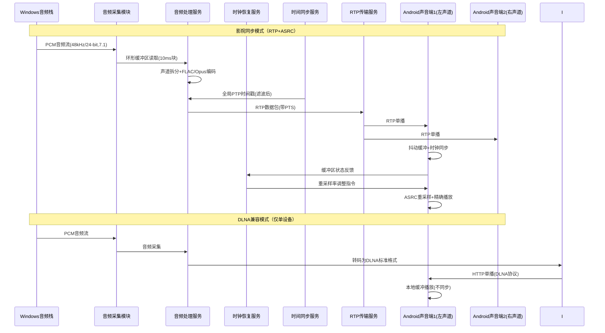

# 跨平台无线音频分发系统完整技术文档（工业级落地优化版）
**文档版本**：v4.0  
**最后更新**：2026年5月24日  
**适用范围**：Windows 7+ → Android 4.4+ 固定WiFi局域网多设备音频同步分发  
**核心修正**：基于工业级实践修正不现实指标、解决DLNA误用问题、补充缺失的核心模块、优化Android兼容性与同步机制

## 目录
1. [系统概述（修正版）](#1-系统概述修正版)
2. [整体系统架构（工业级重构）](#2-整体系统架构工业级重构)
3. [Windows发送端模块设计（落地优化）](#3-windows发送端模块设计落地优化)
4. [Android声音端模块设计（分级兼容+核心补全）](#4-android声音端模块设计分级兼容核心补全)
5. [Android配置端模块设计（功能调整）](#5-android配置端模块设计功能调整)
6. [核心协议与接口规范（RTP标准化）](#6-核心协议与接口规范rtp标准化)
7. [固定WiFi环境专项优化（工业级）](#7-固定wifi环境专项优化工业级)
8. [多设备同步核心系统（重新设计）](#8-多设备同步核心系统重新设计)
9. [开发路线图与风险控制](#9-开发路线图与风险控制)
10. [参考工业级项目与技术依据](#10-参考工业级项目与技术依据)

## 1. 系统概述（修正版）
### 1.1 核心定位修正
本系统是**民用级多房间音频同步方案**，定位为：
- **核心模式**：基于RTP/UDP的低延迟同步播放（支持2.0/2.1/5.1/7.1声道拆分）
- **兼容模式**：标准DLNA单设备播放（不承担同步责任）
- **目标替代**：Sonos Lite、VBAN民用版、Snapcast Windows增强版

**删除所有不现实定位**：
- ❌ 删除"DLNA多机毫秒级同步"
- ❌ 删除"Android 4.4高精度同步"
- ❌ 删除"WiFi环境<1ms同步偏差"

### 1.2 现实可行的核心性能指标
| 指标 | 目标值 | 适用条件 | 说明 |
|------|--------|----------|------|
| 端到端延迟 | 40-80ms | Android 8.0+ / 5GHz WiFi | 声卡模式 |
| | 65-120ms | Android 4.4-7.1 / 2.4GHz WiFi | 声卡模式 |
| 设备间同步偏差 | 5-20ms | Android 8.0+ / 8台并发 | 影院同步模式（用户感知无感） |
| | 20-50ms | Android 4.4-7.1 | 普通同步模式 |
| 最高音质 | 48kHz/24-bit Opus | 声卡模式 |  |
| | 48kHz/16-bit FLAC | 影院同步模式 |  |
| 最大并发设备 | 12台 | 单2.4GHz路由器 |  |
| | 16台 | 单5GHz路由器 |  |
| 抗丢包能力 | 12%丢包无明显爆音 | Opus内建FEC+PLC |  |
| 长期同步稳定性 | 连续播放72小时无漂移 | 音频时钟恢复机制 |  |

### 1.3 设备能力分级（解决Android碎片化）
| 设备等级 | Android版本 | 支持模式 | 同步精度 | 延迟范围 |
|----------|-------------|----------|----------|----------|
| 高精度级 | 10.0+ | 所有模式 | 5-10ms | 40-60ms |
| 标准级 | 8.0-9.1 | 低延迟+影院同步 | 10-20ms | 60-80ms |
| 兼容级 | 4.4-7.1 | 普通播放+DLNA | 20-50ms | 80-120ms |

## 2. 整体系统架构（工业级重构）
### 2.1 修正后三层架构（新增核心模块）


### 2.2 修正后数据流（删除DLNA同步）


## 3. Windows发送端模块设计（落地优化）
### 3.1 音频采集模块（分阶段实现）
**模块ID**：WIN-AUDIO-CAPTURE-001  
**开发优先级**：P0  
**技术栈**：C++ / WASAPI / WDF 1.11 / SYSVAD  
**分阶段实现路线**：
1. **Phase 1（快速验证）**：使用WASAPI环回捕获（用户态，无驱动）
   - 优点：开发快、无签名问题、无蓝屏风险
   - 缺点：无法捕获独占模式音频、延迟略高
2. **Phase 2（产品化）**：基于微软SysVAD样本开发虚拟声卡驱动
   - 完整支持WaveRT端口驱动
   - 系统级音频输出，兼容所有应用
   - 支持7.1声道48kHz/24-bit格式
   - 提供内核-用户态共享内存环形缓冲区

### 3.2 设备发现与多网卡处理（新增）
**模块ID**：WIN-DISCOVERY-MULTINIC-001  
**技术栈**：C++ / SSDP / UDP广播  
**核心功能**：
1. 自动枚举所有网络接口（物理网卡、虚拟网卡、VPN、Docker）
2. 支持手动绑定指定网卡进行设备发现和数据传输
3. 同时发送SSDP广播和UDP广播（端口17083），扫描周期3秒
4. 设备列表显示：硬件UUID、自定义别名、信号强度(RSSI)、设备等级、在线状态
5. 别名管理：支持右键编辑别名，修改后同步至所有配置端和声音端，持久化存储

### 3.3 声道配置模块（全声道支持）
**模块ID**：WIN-CHANNEL-CFG-001  
**核心功能**：
1. 基础模式：勾选设备后快速配置为左声道或右声道（立体声）
2. 高级模式：可视化拖拽式声道配置
   - 2.1声道：左前、右前、低音炮
   - 5.1声道：左前、右前、中置、左环绕、右环绕、低音炮
   - 7.1声道：左前、右前、中置、左环绕、右环绕、左后环绕、右后环绕、低音炮
3. 声道预览：支持点击测试每个声道的音频输出，验证映射关系
4. 配置保存：支持保存多套声道配置方案，一键切换

### 3.4 自动校准服务（新增核心）
**模块ID**：WIN-AUDIO-CALIBRATION-001  
**核心功能**：
1. **延迟自动校准**：播放1kHz脉冲信号，通过Android设备麦克风录制，自动计算端到端延迟
2. **同步偏差校准**：多设备同时录制校准信号，计算设备间相对延迟并补偿
3. **校准结果持久化**：保存每个设备的校准参数，下次连接自动应用
4. 提供手动校准入口，支持用户微调延迟补偿值

## 4. Android声音端模块设计（分级兼容+核心补全）
### 4.1 设备唯一标识（修正）
**模块ID**：AND-DEVICE-ID-001  
**修正后方案**：
1. **主标识**：首次启动生成UUIDv4，保存到`/data/data/xxx/shared_prefs/`（应用卸载前唯一）
2. **辅助标识**：
   - Android 4.4-9：WiFi MAC地址（不可靠但作为补充）
   - Android 10+：使用`Settings.Secure.ANDROID_ID`（恢复出厂会变）
3. **持久化策略**：
   - 本地存储主UUID
   - 发送端保存"主UUID+辅助标识+设备型号"映射
   - 应用重装后自动关联历史配置

### 4.2 双模式音频接收模块
**模块ID**：AND-AUDIO-RECV-001  
**技术栈**：Java / NDK / libopus / libFLAC  
| 模式 | 传输协议 | 编码格式 | 延迟优化 | 适用场景 |
|------|----------|----------|----------|----------|
| 声卡模式 | RTP/UDP（端口17080） | Opus（48kHz/24-bit） | 10ms编码帧长<br>40-150ms自适应抖动缓冲 | 游戏、视频等低延迟需求 |
| 影院同步模式 | RTP/UDP（端口17080） | FLAC（48kHz/16-bit） | 10ms编码帧长<br>60-180ms自适应抖动缓冲 | 音乐播放、多设备影院 |
| DLNA兼容模式 | HTTP（标准DLNA协议） | MP3/FLAC（DLNA标准） | 100ms预缓冲 | 单设备兼容播放 |

### 4.3 音频播放引擎（Oboe标准化）
**模块ID**：AND-AUDIO-PLAY-001  
**技术栈**：C++ / Oboe 1.7.0 / AAudio / OpenSL ES  
**核心优化**：
1. 自动选择音频后端：
   - Android 8.0+：AAudio（优先MMAP+Exclusive模式）
   - Android 4.4-7.1：OpenSL ES（Fast Path）
2. 自动检测设备最佳缓冲区大小，使用设备原生缓冲区
3. 基于Oboe的`onAudioReady`回调实现精确播放调度
4. 增强丢包隐藏(PLC)算法：结合Opus内置PLC和波形插值

### 4.4 音频时钟恢复服务（新增核心）
**模块ID**：AND-AUDIO-CLOCK-RECOVERY-001  
**解决问题**：设备DAC时钟漂移导致的长期不同步和爆音  
**核心实现**：
1. 自适应重采样（ASRC）：动态调整采样率（48000±100ppm）
2. 缓冲区水位控制：维持目标缓冲区大小（±10ms）
3. 平滑调整算法：每次调整不超过1ppm，避免音质突变
4. 参考Snapcast的时钟恢复实现：通过增减采样点实现微调速
5. 实时上报时钟漂移量和缓冲区状态给发送端

## 5. Android配置端模块设计（功能调整）
### 5.1 设备扫描与列表
**模块ID**：AND-CFG-SCAN-001  
**核心功能**：
1. 与Windows端一致的设备扫描机制，显示相同的设备信息
2. 支持按信号强度、别名、设备等级排序
3. 支持批量选择设备，进行统一配置

### 5.2 模式配置模块（修正）
**删除**："DLNA多机同步模式"  
**保留**：
1. **电脑声卡模式**（RTP低延迟）
2. **影院同步模式**（RTP高音质）
3. **DLNA兼容模式**（仅单设备）

**模式参数配置**：
- 声卡模式：调整FEC冗余级别（5%-20%）、Opus比特率（64-256kbps）
- 影院同步模式：调整预缓冲时间（30-120ms）、同步精度等级
- DLNA模式：调整转码质量

### 5.3 设备状态监控（增强）
**新增显示**：
- 设备等级（高精度/标准/兼容）
- 实时同步偏差（ms）
- 缓冲区水位（%）
- 时钟漂移量（ppm）
- 网络丢包率（%）
- 信号强度（dBm）

## 6. 核心协议与接口规范（RTP标准化）
### 6.1 端口分配（修正）
| 端口号 | 协议 | 用途 |
|--------|------|------|
| 17080 | UDP | RTP音频数据传输 |
| 17081 | TCP | 控制命令与配置传输 |
| 17082 | UDP | PTP时间同步报文 |
| 17083 | UDP | 设备发现广播 |
| 17084 | UDP | RTCP反馈报文 |
| 1900 | UDP | SSDP设备发现（DLNA标准） |
| 8200 | TCP | DLNA媒体服务器（标准） |

### 6.2 RTP音频数据包格式
**使用标准RTP协议（RFC 3550）**：
- 版本：2
- 填充：0
- 扩展：1（携带自定义扩展头）
- CSRC计数：0
- 标记：1（表示音频帧结束）
- 负载类型：动态分配（Opus=96，FLAC=97）
- 序列号：16位，用于丢包检测和重排序
- 时间戳：32位，基于PTP时钟
- SSRC：同步源标识符，区分不同声道流

**RTP扩展头格式**：
```
0                   1                   2                   3
 0 1 2 3 4 5 6 7 8 9 0 1 2 3 4 5 6 7 8 9 0 1 2 3 4 5 6 7 8 9 0 1
+-+-+-+-+-+-+-+-+-+-+-+-+-+-+-+-+-+-+-+-+-+-+-+-+-+-+-+-+-+-+-+-+
|      0xBEDE     |           length=1          |               |
+-+-+-+-+-+-+-+-+-+-+-+-+-+-+-+-+-+-+-+-+-+-+-+-+  FEC Level(4) |
| Channel Map(8)  | Sample Format(4) | Reserved(4) |           |
+-+-+-+-+-+-+-+-+-+-+-+-+-+-+-+-+-+-+-+-+-+-+-+-+-+-+-+-+-+-+-+-+
```
**扩展头字段说明**：
- FEC Level：4位，0-15对应5%-20%冗余
- Channel Map：8位，标识当前数据包对应的声道
- Sample Format：4位，标识采样格式（16-bit/24-bit）

### 6.3 RTCP反馈协议
**使用标准RTCP协议**：
- 接收端报告（RR）：上报丢包率、抖动、延迟
- 发送端报告（SR）：发送端时间同步信息
- 应用特定报文（APP）：传输时钟漂移、缓冲区状态等自定义信息

### 6.4 控制命令格式
```json
{
  "type": "COMMAND_TYPE",
  "id": "msg_123456",
  "timestamp": 1716500000000,
  "target_uuid": "1234567890ABCDEF",
  "payload": {}
}
```
**核心命令类型**：
| 命令类型 | 方向 | 说明 |
|----------|------|------|
| `SET_ALIAS` | S→C | 设置设备别名 |
| `SET_MODE` | S→C | 设置工作模式 |
| `SET_CHANNEL` | S→C | 设置声道映射 |
| `START_CALIBRATION` | S→C | 启动自动校准 |
| `SET_RESAMPLE_RATE` | S→C | 设置重采样率 |
| `DEVICE_STATUS` | C→S | 上报设备状态 |

## 7. 固定WiFi环境专项优化（工业级）
### 7.1 网络层优化
1. **RTP代替裸UDP**：利用标准协议的成熟特性，避免重复造轮子
2. **QoS强化**：所有RTP数据包标记DSCP=EF(46)，RTCP标记DSCP=AF41
3. **MTU固定**：1400字节，避免IP分片，实现数据包分片与重组机制
4. **发送速率控制**：基于RTCP反馈动态调整，最大3000kbps（2.4GHz）
5. **拥塞避免**：检测到网络拥塞时自动降低编码比特率

### 7.2 编码层优化
1. **FEC优化**：优先使用Opus内建FEC（10%冗余），不额外实现复杂FEC
2. **编码参数自适应**：
   - 网络好（丢包<2%）：48kHz/24-bit Opus 192kbps
   - 网络一般（丢包2%-5%）：48kHz/16-bit Opus 128kbps
   - 网络差（丢包5%-12%）：48kHz/16-bit Opus 64kbps
3. **声道智能合并**：并发超过8台时自动合并环绕声道，提供"带宽优先"和"音质优先"两种模式

### 7.3 时间同步优化
1. **PTP滤波算法**：使用卡尔曼滤波处理WiFi抖动导致的时间戳噪声
2. **同步周期自适应**：
   - 未同步：50ms
   - 粗同步：200ms
   - 精同步：1000ms
3. **时钟漂移补偿**：实时计算设备时钟漂移率，提前补偿
4. **同步降级机制**：同步精度低于20ms时自动增大抖动缓冲区

### 7.4 播放层优化
1. **自适应抖动缓冲**：缓冲区范围40-150ms（固定2.4GHz环境），基于最近100ms的网络抖动动态调整
2. **平滑缓冲区调整**：缓冲区大小变化时通过微调配速实现平滑过渡，避免爆音
3. **音频预缓冲**：启动播放前预缓冲60ms音频数据，避免初始卡顿

## 8. 多设备同步核心系统（重新设计）
### 8.1 同步原理
**放弃"绝对时间同步"，追求"感知同步"**：
1. 所有设备使用Windows发送端作为主时钟
2. 每个音频块携带全局PTS（播放时间戳）
3. 接收端根据PTS和本地同步时钟计算播放时间
4. 通过ASRC动态调整播放速度，维持缓冲区稳定
5. 人耳对5ms以内的同步偏差基本无感，10ms以内可接受

### 8.2 同步异常处理
1. 同步偏差>20ms：触发快速重校准
2. 同步偏差>50ms：清空缓冲区，重新预缓冲
3. 连续3次校准失败：降级为普通同步模式
4. 网络中断恢复后：自动追赶到当前播放进度

### 8.3 长期同步保障
1. 音频时钟恢复服务持续运行，补偿DAC时钟漂移
2. 每10分钟执行一次自动校准
3. 缓冲区水位异常时自动调整重采样率
4. 发送端定期发送同步基准信号

## 9. 开发路线图与风险控制
### 9.1 分阶段开发路线
| 阶段 | 时间 | 核心任务 | 交付物 |
|------|------|----------|--------|
| Phase 1 | 4周 | 核心功能验证 | Windows WASAPI采集 + Android Oboe播放 + RTP传输 + 基础同步 |
| Phase 2 | 6周 | 功能完善 | 声道拆分 + 设备管理 + 自动校准 + DLNA兼容 |
| Phase 3 | 4周 | 性能优化 | 时钟恢复 + 抗干扰优化 + Android分级兼容 |
| Phase 4 | 4周 | 产品化 | 虚拟声卡驱动 + UI优化 + 稳定性测试 |

### 9.2 主要风险与应对
| 风险 | 影响 | 应对措施 |
|------|------|----------|
| Android音频碎片化 | 高 | 严格设备分级，不追求老设备高精度同步 |
| WiFi抖动导致同步差 | 中 | 卡尔曼滤波+ASRC+自适应缓冲 |
| Windows驱动开发难度大 | 高 | 先做WASAPI版本，驱动后期迭代 |
| 时钟漂移导致长期不同步 | 中 | 实现工业级ASRC时钟恢复 |
| DLNA兼容性问题 | 低 | 仅作为可选兼容功能，不做核心 |
| 多网卡导致发现失败 | 中 | 实现多网卡枚举和手动绑定功能 |

## 10. 参考工业级项目与技术依据
1. **Snapcast**：参考其时钟恢复、缓冲区管理和多设备同步机制
2. **VBAN**：参考其UDP音频传输和低延迟优化
3. **Dante/AES67**：参考其专业音频同步和时钟恢复原理
4. **SoundWire**：参考其Windows到Android音频传输实现
5. **微软SysVAD样本**：虚拟声卡驱动开发基础
6. **Android Oboe文档**：Android低延迟音频最佳实践